# Usage Flows

This document summarizes the user-facing usage flows currently implemented in Spec Kit, based on the repository's CLI, templates, reference docs, and built-in workflows.

## Flow 1: Install and verify the CLI

**Purpose:** get `specify` available locally.

**Typical entry points:**

- Persistent install with `uv tool install`
- One-shot execution with `uvx`
- Air-gapped installation from built wheels

**Key outputs:**

- `specify` executable in PATH, or an ephemeral `uvx` execution context
- Ability to run `specify version` and `specify check`

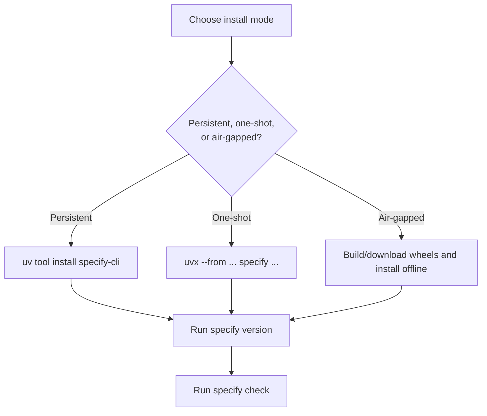

## Flow 2: Initialize a project with `specify init`

**Purpose:** bootstrap a repository for Spec-Driven Development.

**Variants supported by the CLI:**

- Create a new directory or initialize the current one with `--here` / `.`
- Choose one integration with `--integration`
- Choose script flavor with `--script sh|ps`
- Skip Git with `--no-git`
- Install an initial preset with `--preset`
- Use sequential or timestamp branch numbering

**Key outputs:**

- `.specify/` workspace
- templates, scripts, memory files, and optional Git setup
- command files for the selected agent integration

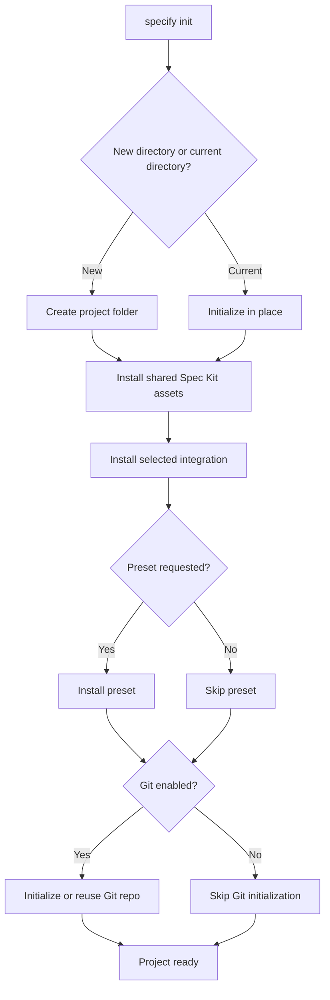

## Flow 3: Establish the project constitution

**Purpose:** define the non-negotiable principles that govern later phases.

**Primary command:** `/speckit.constitution`

**Key output:** `.specify/memory/constitution.md`

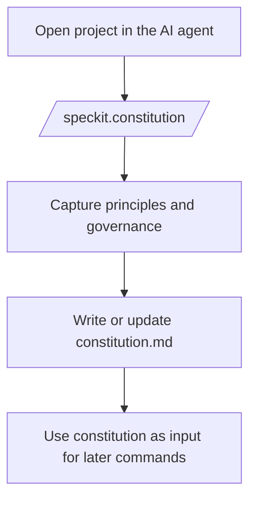

## Flow 4: Create and refine the feature specification

**Purpose:** transform a feature idea into a structured `spec.md`.

**Primary commands:**

- `/speckit.specify`
- `/speckit.clarify` for iterative ambiguity reduction
- `/speckit.checklist` for additional requirement-quality checks

**Key outputs:**

- feature branch and `specs/<feature>/spec.md`
- review checklists under `specs/<feature>/checklists/`

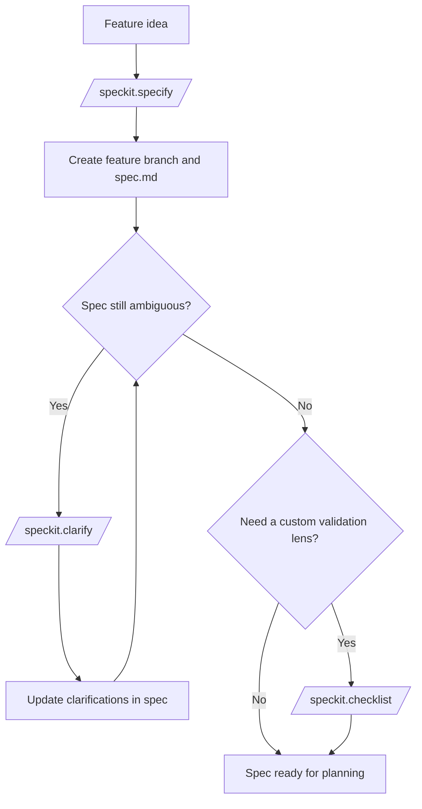

## Flow 5: Generate the implementation plan

**Purpose:** translate approved requirements into technical design artifacts.

**Primary command:** `/speckit.plan`

**Key outputs:**

- `plan.md`
- `research.md`
- `data-model.md`
- `contracts/`
- `quickstart.md`

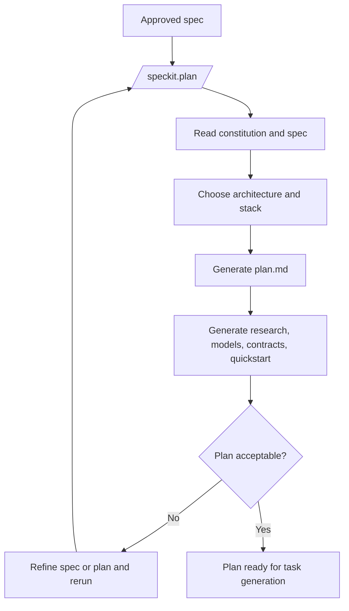

## Flow 6: Generate tasks and validate artifact coverage

**Purpose:** derive an executable work backlog from the plan and validate cross-artifact consistency.

**Primary commands:**

- `/speckit.tasks`
- `/speckit.analyze` (recommended after tasks)

**Key outputs:**

- `tasks.md`
- coverage and consistency feedback before implementation

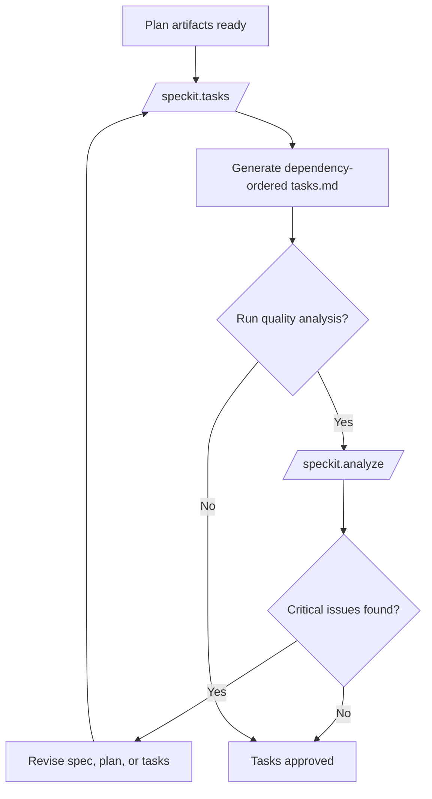

## Flow 7: Convert tasks into GitHub issues

**Purpose:** hand off a finished task plan into repository issue tracking.

**Primary command:** `/speckit.taskstoissues`

**Preconditions:**

- `tasks.md` exists
- repository remote is GitHub

**Key outputs:** one GitHub issue per actionable task

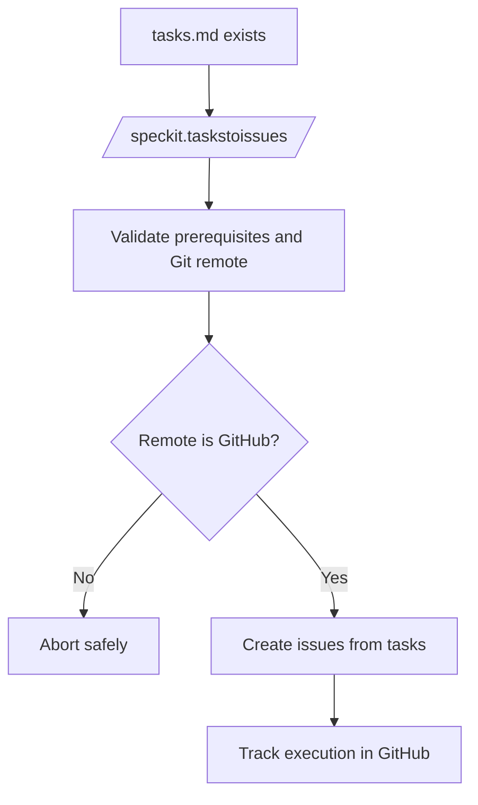

## Flow 8: Implement the feature

**Purpose:** execute the generated task plan.

**Primary command:** `/speckit.implement`

**What the flow does:**

- validates required artifacts
- checks checklist completeness
- follows task ordering and `[P]` parallel markers
- executes work against the files listed in `tasks.md`

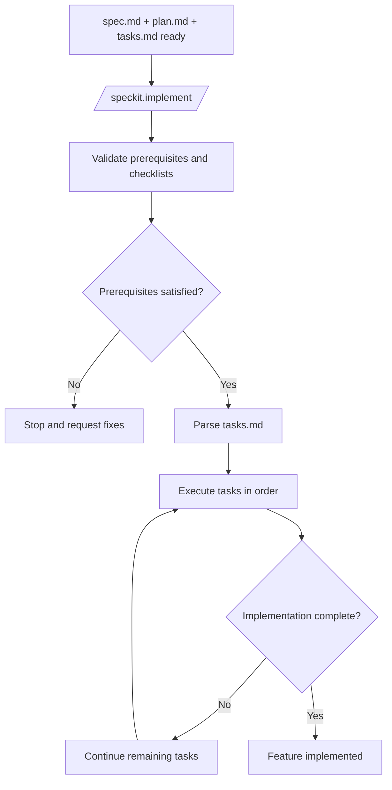

## Flow 9: Manage AI agent integrations

**Purpose:** install, switch, remove, or upgrade the active agent integration.

**CLI surface:**

- `specify integration list`
- `specify integration install`
- `specify integration uninstall`
- `specify integration switch`
- `specify integration upgrade`

**Important rule:** only one integration is active per project at a time.

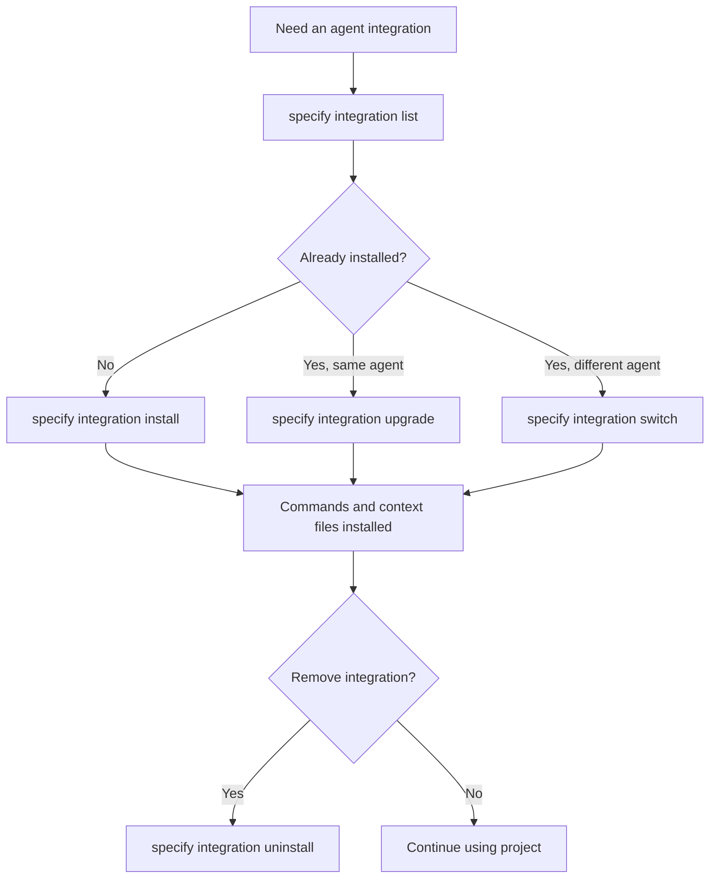

## Flow 10: Customize the workflow with presets

**Purpose:** change how Spec Kit resolves templates, commands, and scripts without adding new capabilities.

**CLI surface:**

- `specify preset search`
- `specify preset add`
- `specify preset list`
- `specify preset info`
- `specify preset resolve`
- `specify preset enable|disable`
- `specify preset set-priority`
- `specify preset remove`

**Key behavior:** multiple presets can coexist and are resolved by priority.

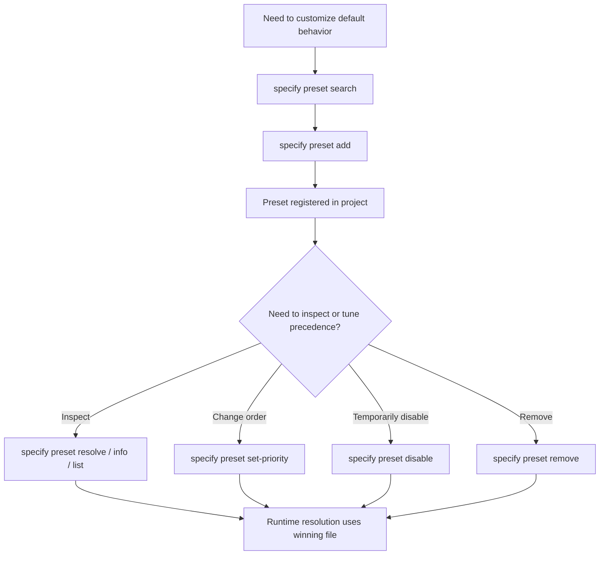

## Flow 11: Extend Spec Kit with extensions

**Purpose:** add new commands, hooks, or external integrations beyond the built-in SDD flow.

**CLI surface:**

- `specify extension search`
- `specify extension add`
- `specify extension list`
- `specify extension info`
- `specify extension update`
- `specify extension enable|disable`
- `specify extension set-priority`
- `specify extension remove`

**Key behavior:** multiple extensions can coexist and can attach hooks to core commands.

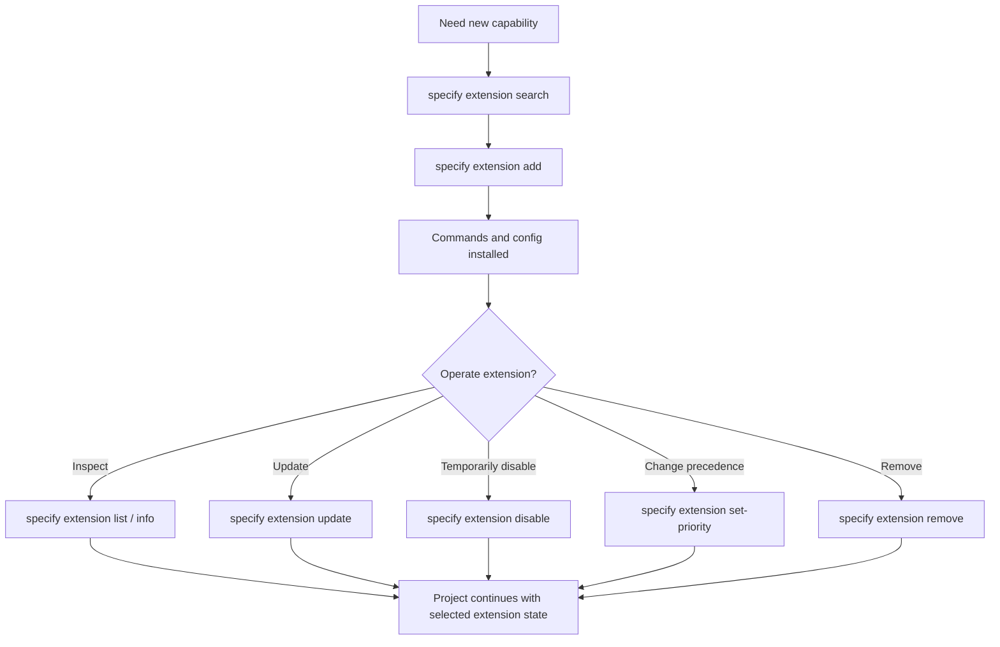

## Flow 12: Automate the lifecycle with workflows

**Purpose:** run a resumable multi-step automation pipeline instead of manually invoking each command.

**CLI surface:**

- `specify workflow search`
- `specify workflow add`
- `specify workflow run`
- `specify workflow status`
- `specify workflow resume`
- `specify workflow info`
- `specify workflow remove`

**Supported sources:** installed workflow ID, HTTPS URL, or local YAML file.

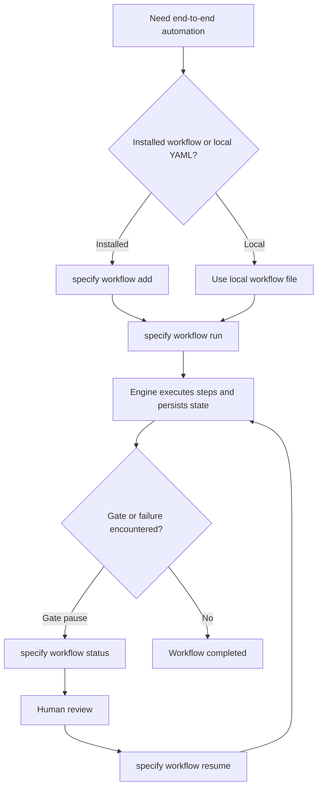

## Flow 13: Operate and maintain the installation

**Purpose:** keep the local setup healthy as the project evolves.

**Common commands:**

- `specify check`
- `specify version`
- `specify integration upgrade`
- `specify extension update`
- `specify preset resolve`
- `specify workflow status`

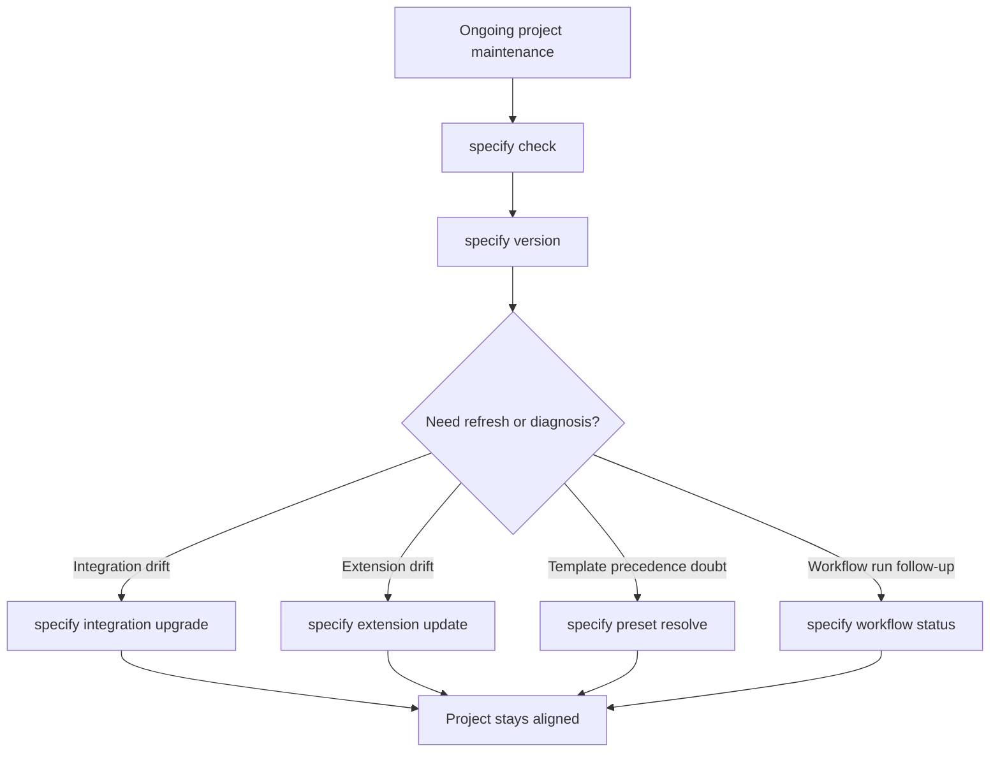

## Recommended end-to-end path

For most teams, the default path through the repository is:

1. Install the CLI
2. Run `specify init`
3. Use `/speckit.constitution`
4. Use `/speckit.specify`
5. Iterate with `/speckit.clarify` and `/speckit.checklist` as needed
6. Use `/speckit.plan`
7. Use `/speckit.tasks`
8. Run `/speckit.analyze`
9. Optionally run `/speckit.taskstoissues`
10. Use `/speckit.implement`
11. Layer presets, extensions, or workflows when the team needs more automation or customization
